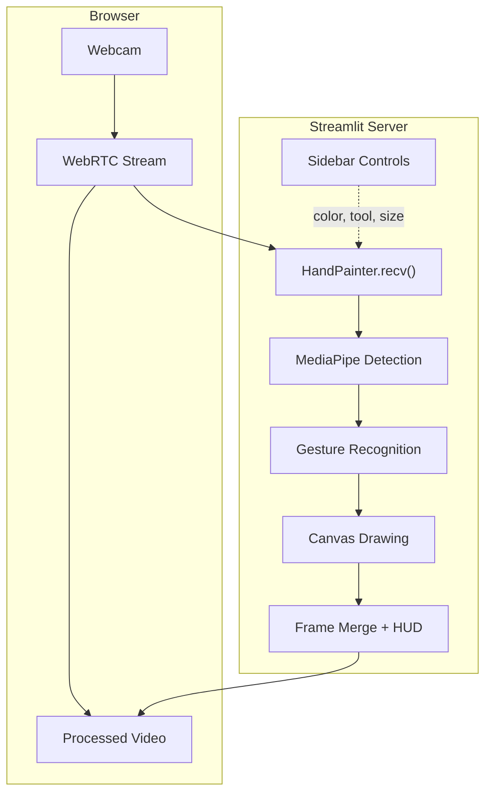

<div align="center">

#   Virtual Painter

### Draw in the air using hand gestures — powered by MediaPipe AI

[](https://python.org)
[](https://streamlit.io)
[](https://mediapipe.dev)
[](https://opencv.org)
[](LICENSE)

<br/>

A real-time virtual painting application that uses ** hand tracking** to let you draw in the air with your webcam. Features a premium dark-themed Streamlit web interface with gesture-based controls, multiple drawing tools, and an interactive canvas.

<br/>


---

##  Features

| Feature | Description |
|---------|-------------|
|  **Hand Tracking** | Real-time 21-landmark hand detection via MediaPipe |
|  **Freehand Drawing** | Draw smooth strokes by pointing your index finger |
|  **Shape Tools** | Draw rectangles and circles with live preview |
|  **Color Palette** | 5 vibrant colors + eraser with visual swatch bar |
|  **Adjustable Brush** | Slider from 2px to 50px with live size preview |
|  **Undo Support** | Up to 25 levels of stroke-based undo |
|  **Save & Download** | Export drawings on white background as PNG |
|  **Premium Dark UI** | Glassmorphism sidebar, gradient accents, micro-animations |
|  **Live HUD** | Mode badge + tool info overlay on the video feed |

---

##  Gesture Guide

Control the app entirely with hand gestures — no keyboard needed:

| Gesture | Fingers | Action | Cooldown |
|---------|---------|--------|----------|
|  | Index only | **Draw** on canvas | — |
|  | Index + Middle | **Hover** / Idle mode | — |
|  | All 5 fingers | **Clear** entire canvas | 2 seconds |
|  | Index + Pinky | **Save** drawing to file | 3 seconds |

> **Tip:** The mode badge on the top-left of the video shows your current gesture state in real time.

---

##  Tech Stack

```
┌─────────────────────────────────────────────────────────┐
│  Frontend       Streamlit (dark theme + custom CSS)     │
│  Video Stream   streamlit-webrtc (WebRTC via browser)   │
│  Hand Tracking  MediaPipe Hands (21 landmarks)          │
│  Image Processing  OpenCV + NumPy                       │
│  Threading      Python threading.Lock for canvas safety │
└─────────────────────────────────────────────────────────┘
```

---

##  Quick Start

### Prerequisites

- **Python 3.10+**
- A working **webcam**
- A modern browser (Chrome / Edge recommended)

### Installation

```bash
# 1. Clone the repo
git clone https://github.com/Meet-Tilala/-Hand-Tracker-Canvas.git
cd Hand-Tracker-Canvas

# 2. Install dependencies
pip install streamlit streamlit-webrtc mediapipe==0.10.14 opencv-contrib-python numpy

# 3. Launch the app
python -m streamlit run app.py
```

The app opens at **http://localhost:8501** — click **START** to enable your webcam and begin painting! 🎨

---

##  Project Structure

```
Hand-Tracker-Canvas/
├── app.py                  #  Streamlit web app (main entry point)
├── virtual_painter.py      #   Desktop version (OpenCV window)
├── .streamlit/
│   └── config.toml         #  Dark theme configuration
├── Premium_Notes/           #  Saved drawings (auto-created)
└── README.md
```

---

##  Two Modes Available

###  Web App (Recommended)

```bash
python -m streamlit run app.py
```

- Browser-based interface with premium dark UI
- Sidebar controls for colors, tools, brush size
- Save & download drawings directly
- Works on any device with a webcam + browser

###  Desktop App (Legacy)

```bash
python virtual_painter.py
```

- Native OpenCV window
- On-screen gesture-based dashboard
- Keyboard shortcuts: `Q` Quit, `C` Clear, `S` Save, `U` Undo

---

##  Architecture



### Key Design Decisions

- **Thread Safety:** The canvas lives in the WebRTC worker thread. A `threading.Lock` protects reads/writes when the Streamlit main thread accesses it (for clear, undo, save).
- **Stroke-Level Undo:** History snapshots are pushed once per freehand stroke (not per line segment), giving clean undo behavior.
- **Live Shape Preview:** Rectangle/circle shapes are previewed on the video frame (not committed to canvas) until the drawing gesture ends.
- **HUD Overlay:** Mode and tool badges are rendered with OpenCV directly on the frame for real-time feedback, independent of Streamlit reruns.

---


---

##  Configuration

### Streamlit Theme

Customise the theme in `.streamlit/config.toml`:

```toml
[theme]
primaryColor = "#764ba2"
backgroundColor = "#0e1117"
secondaryBackgroundColor = "#161b22"
textColor = "#e0e0e0"
```

### Hand Detection Tuning

Adjust sensitivity in `app.py` inside the `HandPainter.__init__` method:

```python
self.hands = mp_hands_module.Hands(
    max_num_hands=1,
    min_detection_confidence=0.72,  # Lower = more sensitive
    min_tracking_confidence=0.65,   # Lower = smoother tracking
)
```

---

##  Contributing

Contributions are welcome! Feel free to:

1.  Fork the repository
2.  Create a feature branch (`git checkout -b feature/amazing-feature`)
3.  Commit changes (`git commit -m 'Add amazing feature'`)
4.  Push to the branch (`git push origin feature/amazing-feature`)
5.  Open a Pull Request

---

##  License

This project is open source and available under the [MIT License](LICENSE).

---

<div align="center">


</div>
